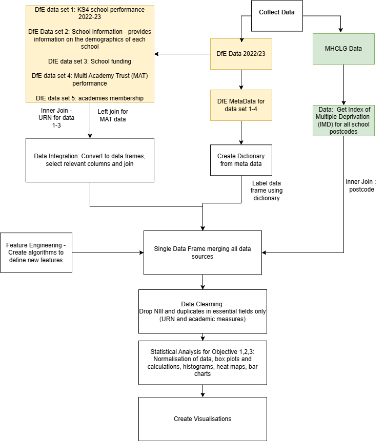
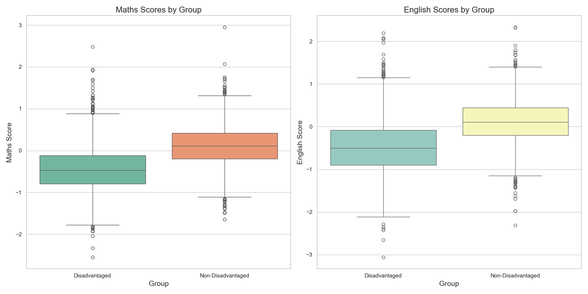
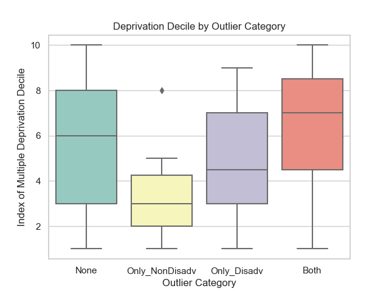
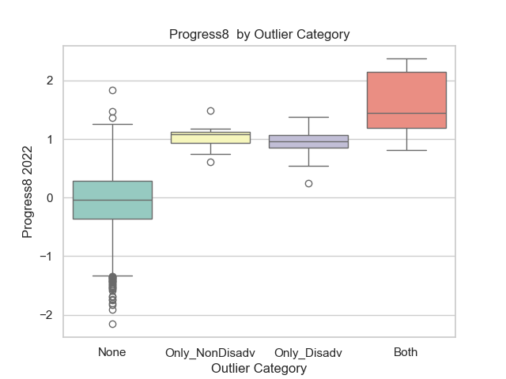
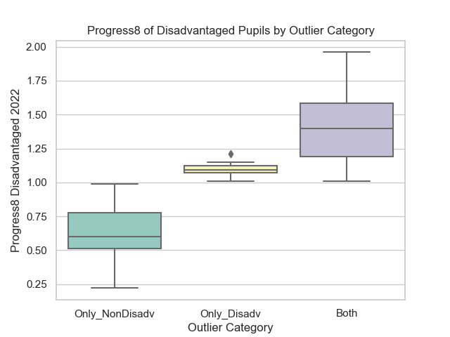
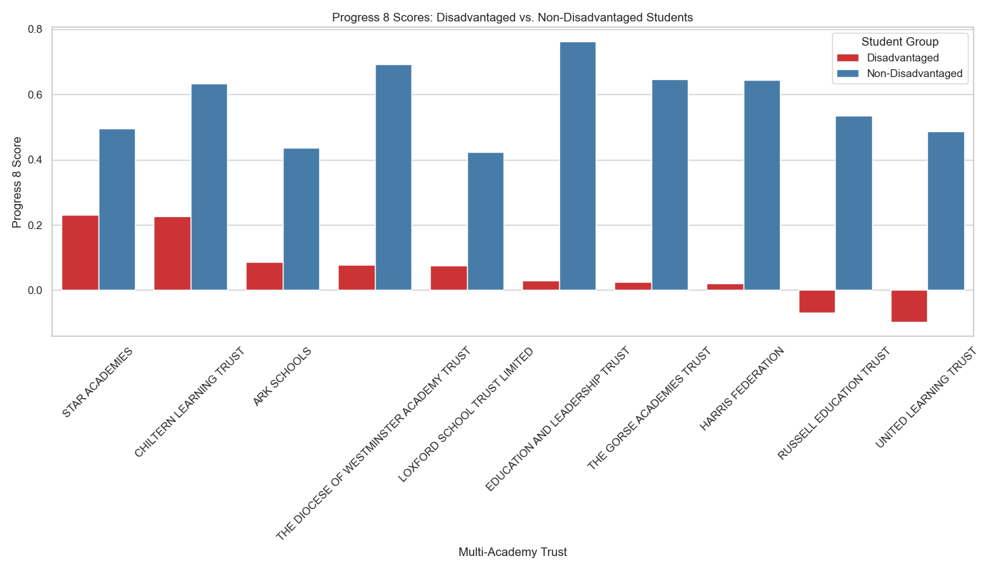

# Developing Education Equity: Analysing Positive Outlier Schools' Performance at Keystage 4 for Disadvantaged Pupils in the UK - 2022/23

## Project Overview
This project analyzes the performance of positive outlier schools in the UK (2022/23) in terms of their disadvantaged pupils' educational outcomes at Key Stage 4. The analysis focuses on the correlation between school performance, measured through the Progress 8 and Attainment 8 scores, and the Index of Multiple Deprivation (IMD).

### Dataset
The datasets for this project were sourced from the Department for Education (DfE) and the Ministry of Housing, Communities and Local Government (MHCLG). They provide key metrics on school performance and socioeconomic data for the academic year 2022-23.

### Objectives
- 1. Evaluate National Disparities in Educational Performance Between Advantaged and Disadvantaged Pupils**
- 2. Identify and analyse outlier schools nationally for progress 8 scores for disadvantaged pupils and investigate contributing factors.**
- 3. Identify and evaluate the top performing multi-academy trusts in supporting disadvantaged pupils.**

This objective will conduct statistical analysis to identify top performing multi-academy trusts and their success in closing the disadvantage gap. Hypothesis testing and regression analysis will be conducted to determine the level of impact of potential factors

## Project Structure
```
/P4DS_A2_Data_Analysis_Project.ipynb  # The main Jupyter notebook
/requirements.txt                    # List of dependencies
/LICENSE                             # Project License (MIT)
/.gitignore                          # Files to ignore in the GitHub repository
```


## License
This project is licensed under the MIT License - see the [LICENSE](LICENSE) file for details.

## Project Plan
### 1.1 Sources of the dataset
a) Department for Education (DfE)
The multiple datasets are sourced from the Department for Education's (DfE) website [1][2]. The academic year 2022-23 is the most recent data and published on 1st February 2024. Five datasets from the DfE website were used in this analysis. For each of the data sets a separate file containing the metadata is also provided. The data sets were merged based on the Unique Reference Number (URN) column for each school. Progress 8 scores are used to evaluate school performance; this is a measure of the value-added by each school based on the progress made across 8 qualifications of each pupil, using their key stage 2 results from year 6 as a baseline. The attainment 8 score (total points across 8 subjects) of each pupil is similar key stage 2 results, is compared to the national average attainment 8; the difference indicates a level of progress. A progress 8 score of 1, would indicate the student has done better by 1 grade than the national average etc. Subjects included in progress 8 include:

English and Mathematics - both double weighted due to importance

EBacc Subjects - three slots from subjects such as sciences, computer science, history, geography and languages

Open Group - remaining three from other academic, arts of vocational subjects

The DfE has data of the progress 8 score and funding for disadvantaged and non-disadvantaged students, which makes its very convenient to analyse.

b) Index of Multiple Deprivation (IMD)
In addition to the four data sets from the DfE, rather than use funding for schools or number of disadvantaged pupils, the deprivation index for each area in the UK was downloaded from the Ministry of Housing, Communities and Local Government (MHCLG) website [3] and merged with the school information data set using the school postcode. This allows for a more detailed analysis of the relationship between school performance and socioeconomic factors which may affect the performance of disadvantaged students.

### 1.2 Accuracy and Reliability of Data
The data is sourced from the Department for Education's (DfE) website and the Ministry of Housing, Communities and Local Government website. The data is accurate and reliable as it is sourced from official government sources. For the DfE, provisional and final KS4 results are provided. The key differences are the final results are quality assured for:

a) Completeness of data: results are verified

b) Accuracy of data: results are corrected for any errors or omissions

c) Usage: results are approved for use in official publications and are publicly available.

The categorise each school's socioeconomic status, the Index of Multiple Deprivation Decile (IMD) is used, which ranks each postcode in England between 1 and 10. The IMD is a composite measure of deprivation based on several other domains of deprivation including income, employment, education and health. The data is from an official government source and is therefore accurate and reliable.

### 1.3 Data quality, usability, and presentation
Considerations:

The IMD data is from 2019 and is the nearest year to the academic year 2022-23 of school performance data. When evaluating the relationship between school performance and socioeconomic factors, the socioeconomic factors may have changed in some cases since 2019. However, I will treat these are negligible changes as it the three-year period between 2019 and 2022 is relatively short.
As the analysis in based on school performance on a national level, including thousands of schools, I will use 'inner' joins to merge the datasets to ensure the analysis is not affected by schools which are not recognised. I will also drop any rows with missing values in key columns used for analysis.
Project Aim and Objectives
2.1 Context and motivation
Context
I have been working in education for two decades now. More recently, I have worked in MATs that are high performing and data-driven. The efficiency of a school/MAT in using its funds, together with the impact of its pedagogoical framework can be seen unsing progress 8 scores. It has been shown that by five years of age, only 57% of disadvantaged pupils achieve a good level of development compared to 74% from better off households[4]. The gap continues throughout education; in 2022 -2023, 29% of free-school mean (FSM) pupils went to university which 49.8% of non FSM pupils progressed to university. [5].

## Motivation
Several motivations underpin this analysis:

In a recent letter from the secretary of state for education, five priuorities were set out for higher education proviers, to top of which is : "Play a stronger role in expanding access and improving outcomes for disadvantaged students. The gap in outcomes from higher education between disadvantaged students and others is unacceptably large and is widening, with participation from disadvantaged students in decline for the first time in two decades." [6]

Enhancing Education Practice: Some secondary schools are able to close the gap and give students from disadvantaged backgrounds better opportunities to progress to university. This data science investigations aim to identify outlier schools who outperform what is expected from them.

Justifying School Funding: Given the various avenues of funding data available, e.g. pupil premium for disadvantaged pupils, school-led tutoring funding, and the results for FSM and non FSM students, progress 8 and Eng - Maths, the efficiency of schools in using their funds can be evaluated. I can also examine if their is a correlation between progress 8 of disadvantaged and the level of funding schools receive to support them.

Understand demographic factos: Analysis of school demographics, e.g. gender, school type, local authority, can help to undertand their influence on school performance.

Socioeconomic factors: The relationship between school performance and socioeconomic factors such as deprivation can be explored by merging the school performance data with the deprivation index for each area in the UK. Other factors such percentage of disadvantaged students, percentage of non-disadvantaged students, pupil premium funding, percentage of disadvantaged students achieving grades 9-5 in English and Maths, can also be explored.

Impact of MAT: Group level management, collaboration and performance, particularly on outlier schools, can be explored to determine if their is a correlation between school performance and the type of MAT they belong to.

## 2.2 Specific Objective(s)
1. Evaluate National Disparities in Educational Performance Between Advantaged and Disadvantaged Pupils

Using comprehensive datasets from the Department for Education (DfE) and the Ministry of Housing, Communities, and Local Government (MHCLG), conduct a detailed national-level analysis of the performance gap in key metrics, including Progress 8, Attainment 8, and English and Mathematics scores. This objective will involve merging, cleaning and validating data, before statistical analysis is conducted to determine the level of gap between disadvantaged and advantaged pupils

2. Identify and analyse outlier schools nationally for progress 8 scores for disadvantaged pupils and investigate contributing factors.

This objective will conduct more in depth statistical analysis to identify positive outlier schools with progress-8 scores for disadvantaged pupils. Further analysis on quantitative and categorical factors will be conducted to determine the influence of socio-economic indicators, such as the Index of Multiple Deprivation and demographics of the school.

3. Identify and evaluate the top performing multi-academy trusts in supporting disadvantaged pupils.

This objective will conduct statistical analysis to identify top performing multi-academy trusts and their success in closing the disadvantage gap. Hypothesis testing and regression analysis will be conducted to determine the level of impact of potential factors.

System Design
Architecture
Key Components: Descriptions, Purpose and Challenges

The following data sets will be downloaded and used from the DfE website.

1. DfE data set 1: KS4 school performance 2022-23

Purpose: This provides information on the academic performance of each school and provides categories relating to advantage and disadvantage pupils in progress 8, attainment-8 and in EBACC subjects English and Mathematics. The description of each field is given below.

Key fields used for analysis:

  • URN (Unique Reference Number)
  • Average Attainment 8 score
  • Average Progress 8 score 
  • Percentage of disadvantaged students
  • Percentage of non-disadvantaged students
  • Percentage of disadvantaged students achieving grades 9-5 in English and Maths
  • Percentage of non-disadvantaged students achieving grades 9-5 in English and Maths
  • Attainment 8 score for non-disadvantaged students
  • Progress 8 score for non-disadvantaged students
  • Attainment 8 score for disadvantaged students
  • Progress 8 score for disadvantaged students
  • Progress 8 score in Maths for disadvantaged students
  • Progress 8 score in English for disadvantaged students
  • Progress 8 score in Maths for non-disadvantaged students
  • Progress 8 score in English for non-disadvantaged students
2. Data set 2: School information - provides information on the demographics of each school.

Purpose: The purpose of this data set it to determine school demographics such as gender, Ofsted rating etc, and other such categorical columns which can be used to determine potential impact on students' progress.

Key fields used in analysis:

    - URN - Unique Reference Number for the school
    - Local Authority Name (LANAME) - Name of the local authority the school belongs to
    - Local Authority Code (LA) - Numeric code identifying the local authority
    - School Type - Type of school (e.g. Academy, Community School, etc.)
    - Minor Group - More detailed classification of school type
    - Gender - Whether the school is mixed, boys only or girls only
    - Ofsted Rating - Latest Ofsted inspection rating for the school
3. Data set 3: School funding

Purpose: Provides information on the various types of funding for each school.

Key fields used in analysis:

    - School UKPRN: Unique ID number for each school provider
    - School URN: Another unique ID number for each school
    - Time Period: The academic year the funding is for
    - FSM Funding: Money given to schools for students eligible for free school meals
    - FSM6 Funding: Money given for students who were eligible for free school meals in the past 6 years
    - Pupil Premium: Extra funding given to help disadvantaged students
    - Pupil Premium Pupils: Number of students who qualify for pupil premium funding
    - School-led Tutoring Funding: Money given to schools to provide extra tutoring
    - Total Funding: The total amount of funding received by the school
4. DfE data set 4: Multi Academy Trust (MAT) performance

Purpose: provides information of performance for each Multi-Academy Trust (MAT)

Key fields used from MAT performance data:

    - Trust Name: Name of the Multi-Academy Trust
    - Trust UID: Unique identification number for the trust
    - Trust ID: Alternative ID code for the trust
    - Number of Institutions: Number of schools in the trust
    - Total Pupils: Total number of pupils across all schools in the trust
    - Average Attainment 8 Score: Average attainment score across 8 subjects for the trust
    - Average Progress 8 Score: Average progress score showing value added by trust
    - Time Period: Academic year the data is from
5. Data set 5: Academies membership

Purpose: provides information on which MAT each school belongs to allowing external data such as to be linked to schools through their postcode and then to URN.

Key fields used in analysis:

    - URN - Unique Reference Number for the school
    - Group UID - Unique identifier for school group/trust
    - Group ID - Alternative identifier for school group/trust  
    - Establishment Name - Official name of the school
    - Group Name - Name of the school group/trust
    - Postcode - Postcode of the school
6. MHCLG Data - Index of Multiple Deprivation (IMD)

Purpose: In addition to the five data sets from the DfE, the deprivation index for each area in the UK will be downloaded from the Ministry of Housing, Communities and Local Government (MHCLG) website and merged with the school information data set using the school postcode. This allows for a more detailed analysis of the relationship between school performance and socioeconomic factors which may affect the performance of disadvantaged students, as compared to say relying solely on funding data or percentage of disadvantaged pupils.

Key columns used for analysis:

    - Postcode                                   
    - Index of Multiple Deprivation Decile    
7. Metadata

Purpose: To identify the appropriate columns for analysis from the DfE data sets, the metadata will be used. Each of the DfE data sets lists above will have a corresponding meta-data file.

8. Classes

Purpose: To optimise the processes above, functions will be organised in classes

Challenges: Key challenges will be selecting and identify the appropriate columns from the DfE data sets as the data set a very large number of fields. The meta data file will be needed to be used to identify the code and description for each field. The code used would then need to be re-written in most cases so it is clear to the non-technical reader what the field stands for, while retaining a format suitable for a data column in python. Another challenge will be ensuring data types are in the correct format for quantitative analysis. Where needed, feature engineering would need to be employed for new fields which may be required such as pupil premium funding per pupil. Another challenge will be in connecting the index of multiple deprivation IMD with each school, as the MHCLG is independent to the DfE, and will not include the school URN which is what will be used to combined the DfE data.

Pipeline and Workflow

The pipline starts by setting up necessary functions and classes for data loading, wrangling and cleaning.

Determine necessary functions and classes needed for the project

Data Collection: Collect 2022-23 school and MAT performance data from the Department for Education (DfE); this includes the five data sets listed above and their meta files.

Data Collection: Collect data from the inistry of Housing, Communities and Local Government (MHCLG) website; Index of Multiple Deprivation Decile (IMD)

Meta Data: Read the metadata for each data set to understand the data and variables. Create a dictionary of code and description.

Using the meta-data fields extract the key columns for analysis from the data files.

Data Integration: Merge the data sets based on the Unique Reference Number (URN) column for each school.

Data Cleaning: Clean the data to remove any missing values and inconsistencies. Convert data to appropriate data types.

Nomenclature: Determine new naming convention using meta-data dictionary and assign this to the data files.

Feature Engineering: Create algorithms to define new features e.g pupil premium funding per pupil, key stage4_maths_gaps, keystage4 English gap and progress 8 gap between advantaged and disadvantaged pupils.

Data Integration: Socioeconomic Indexing - incorporate the Index of Multiple Deprivation Decile (IMD) for each postcode to the school information data set.

Statistical Analysis and Modelling: Conduct statistical analysis to determine advantage - disadvantage gap, identify outlier schools and top 10 performing MATs. Evaluate the impact of socioeconomic and other factors on school performance

Visualisation: Create visualisations to present the findings.

Conclusion: Summarise the findings and relate them to the original objectives.



For a more dynamics view, workflow diagram can also be viewed here

### Processing Modules and Algorithms
The following modules and algrorithms will be required in a number of instances and therefore defined and written within a class:

Class: DataWrangler - load data from CSV, Excel file or existing pands data frame
Methods:

Load a csv file into a pandas dataframe using load_csv method

Load an excel file into a pandas dataframe using load_excel method

Create a dictionary from a dataframe using make_dictionary method

Rename columns in a dataframe using a dictionary using column_rename method - substitute original column names with descriptive names in a dictionary or list

Convert percentage strings in specified columns to float values using convert_percentage_columns method

Retrieve specific columns from a given dataframe using a set of URNs using get_school_details method

Plot boxplots, histograms, heatmaps and scatter plots to visualise the data

Write code to generate summary statistics of the boxplots

## Project Outcome

### Overview of Results

#### Objective 1: Evaluate National Disparities in Educational Performance

There significant gaps between non-disadvantaged and disadvantaged pupils including attainment 8, progress 8, Maths, English and strong passes in both. Disadvantaged pupils lag behind by approximately 1.45 GCSE grades per subject and have an attainment 8 gap of 11.6 points. Their Progress 8 scores are 0.6 grades lower across subjects than their peers, suggesting significant performance gaps.

#### Objective 2: Identify and Analyse Outlier Schools in Positive Progress 8 of Disadvantaged Pupils

Schools excelling in progress 8 for disadvantaged students, tend to support all students very well and have a strong positive correlation (0.85) between overall and disadvantaged pupils. Funding has a negative correlation with Progress 8 scores for disadvantaged pupils, and could be investigated further.

#### Objective 3: Identify and Evaluate Top Performing Multi-Academy Trusts (MATs)

High performing MAT have shown a strong positive correlation (0.51) between progress 8 scores for disadvantaged students and overall scores. Although socio-economic factors negatively correlate (-0.37) with progress, for high performing MATs this hasn’t been seen to be a barrier; Star Academies for example is one of the highest performing MATs in the country, yet faces the highest deprivation average of all MATs, suggesting a robust pedagogical strategy and governance to run its schools. Such high performing MATs are good at closing the gap (smallest is 0.264 progress 8) between disadvantaged and advantaged students, demonstrating efficient use of funding and better equity.

### Objective 1: Evaluate National Disparities in Educational Performance Between Advantaged and Disadvantaged Pupils
Explaination of Results:

There are positive gaps in all categories measured between advantaged and disadvantaged pupils, confirming that nationally, isadvanteged pupils are behind in every academic measure.

Attainment 8 Gap:

Attainment 8 Disadvantaged: 40.22

Attainment 8 Non-Disadvantaged: 51.83

Attainment 8 Gap: 11.61

Analysis: The attainment 8 gap of 11.6 points between disadvantaged and advantaged pupils nationally, suggest approximately 1.45 GCSE grades lower per subject for disadvantaged stidents (11.61/8 = 1.45125 - as each subject is given a point based on the GCSE grade e.g. grade 9 = 9 points).

Progress 8 Gap:

Progress 8 Disadvantaged: -0.47

Progress 8 Non-Disadvantaged: 0.13

Progress 8 Gap: 0.60

Analysis: Progress 8 gap of 0.60 that disadvantaged pupils are making 0.6 grades less progress across 8 subjects between keystage 2 and keystage 4 nationally. This would amount to 0.075 grade point less in each of the 8 subjects (0.60/8=0.0.075)

Subject Specific Gaps:

Maths Disadvantaged: -0.44

Maths Non-Disadvantaged: 0.11

Maths Gap: 0.55

English Disadvantaged: -0.46

English Non-Disadvantaged: 0.12

English Gap: 0.58

Analysis: Maths gap of 0.55 and English gap of 0.58 suggest, nationally, disadvanted students are underperforming or making 0.55 grade less progress in maths and 0.58 less progress in English, between keystage 2 and keystage 4 nationally.

Perventage 9-5 Gap:

Percentage Disadvanted EngMaths_95: 28.09

Percentage Nondisadv Student EngMaths_95: 50.01

Percentage_95 Gap: 21.92

Analysis: Signficcant gap of 21.92 percentage points nationally between disadvatanged and advantaged students achieving grade 5 or above in English and Maths, suggests this needs to be addressed.

Visualisation
Distribution of Progress 8 Scores

Attainment 8 Scores Summary:

Group	Median	Q1 (25%)	Q3 (75%)	IQR	Min	Max	Range
Disadvantaged	38.8	34.5	44.2	9.7	12.9	84.1	71.2
Non-Disadvantaged	51.3	46.6	56.2	9.6	11.2	86.5	75.3
Progress 8 Scores Summary:

Group	Median	Q1 (25%)	Q3 (75%)	IQR	Min	Max	Range
Disadvantaged	-0.49	-0.87	-0.12	0.75	-2.43	1.96	4.39
Non-Disadvantaged	0.13	-0.16	0.45	0.61	-2.33	2.37	4.70
The histrogram showes an approximately normal distribution, as expected, since the results are standardised by exam boards. Most sudents would therfore have a progress 8 score of 0, with 68% of students falling within +1 or -1 standard deviations from the mean and 95% falling within +2 or -2 standard deviations from the mean.

Obj1_progress8_distribution_nationally.png

Progess 8 and Attainment 8 Box Plots

Both box plots show disadvantaged students under performing. For progress 8, disadvatanged students have a negative progress 8 of -0.49 median score while advtanged students have a positive median score of 0.13, suggesting significant disparity. Both have a similar range and interquratile range with a number of outliers. For attainment 8, the gap and distribution is as expected given the results.

progress8_attainment8_boxplot.png

Percentage English and Mathematics Five Plus Box Plots

Maths Scores Summary	Median	Q1 (25%)	Q3 (75%)	IQR	Min	Max	Range
Disadvantaged	-0.47	-0.79	-0.12	0.67	-2.55	2.48	5.03
Non-Disadvantaged	0.11	-0.20	0.42	0.62	-1.65	2.95	4.60
English Scores Summary	Median	Q1 (25%)	Q3 (75%)	IQR	Min	Max	Range
Disadvantaged	-0.50	-0.90	-0.08	0.82	-3.06	2.19	5.25
Non-Disadvantaged	0.11	-0.20	0.44	0.64	-2.31	2.33	4.64

Both Maths and English have a negative median of -0.47 and -0.50 which is very concerning, given this is a national pattern, showing progress made by students between keystage 2 and keystage 4. English has a wider interquartile range for disadvantaged students, suggesting more variability. In both subjects, there is a greater difference between the minimum values, then between the maximum values, suggesting the disadvatnaged students will significiantly underperform than over perform.



Objective 2 Identify and Analyse Outlier Schools in Positive Progress 8 of Disadavantaged Pupils
Explanation of Results
Outlier schools for progress 8 were identified and then further categories as:

a) Schools which are outliers only for non-disadvantaged pupils

b) Schools which are outliers only for disadvantaged pupils

c) schools which are outliers for both non-disadvantaged and disadvantaged

Overall schools which are outliers in both categories will do significantly better for disadvantaged pupils.
There is also a higher correlation (0.85) between progress 8 disadvantaged pupils and progress 8 in general, suggesting success breeds success.
Unexpectedly, funding (FSM(-0.45), total (-0.48) and pupil premium (-0.45)) all have negative correlation with progress 8 disadvantaged. This would need to be explored further as the range of the funding may be very small, and not being a good measure of proportionality.
Small postitive correlation of progress 8 disadvantaged with percentage of disadvantage pupils (0.19) suggest disadvantaged pupils may do better where there are more such pupils.
Index of multiple deprivation - has a negative correlation, suggesting lower values of the index ie. deprivation decreased, progress9 disadvantaged pupils will decline slightly, suggesting disadvantaged pupils' performance is expected to decrease when there is more deprivation.
Visualisation

Heatmap provides insights into outlier schools in areas such as progress 8 score, funding, deprivation index etc.

Heatmap of Outlier Schools

Summary Statistics for 'Index of Multiple Deprivation Decile' by 'Outlier_Category'

Outlier Category	Median	Q1 (25%)	Q3 (75%)	IQR	Min	Max	Range
Both	7.0	4.5	8.5	4.0	1.0	10.0	9.0
None	6.0	3.0	8.0	5.0	1.0	10.0	9.0
Only Disadvantaged	4.5	3.0	7.0	4.0	1.0	9.0	8.0
Only Non-Disadvantaged	3.0	2.0	4.3	2.3	1.0	8.0	7.0
Outlier schools only in progres 8 for only non-disadvantaged students, stand out as having a significanlty lower median of deprivation index, suggesting non-disadvantaged students tend to come from more deprived areas in such schools. This could be due to more focused support given they would stand out and be top of their school.



Summary Statistics for 'Progress8' by 'Outlier_Category'

Outlier_Category	Median	Q1 (25%)	Q3 (75%)	IQR	Min	Max	Range
Both	1.450	1.1950	2.140	0.945	0.81	2.37	1.56
None	-0.040	-0.3600	0.290	0.650	-2.16	1.83	3.99
Only_Disadv	0.955	0.8500	1.070	0.220	0.25	1.38	1.13
Only_NonDisadv	1.085	0.9375	1.125	0.188	0.61	1.49	0.88
Non positive outlier schools are are expected nearing 0; the minor difference may be due to negative outlier schools being included in that group. Schools which are outliers in both categories are much better performing with highest median and maximum score.



Summary Statistics for 'Progress8_Disadvantaged_2022' by 'Outlier_Category':

Outlier_Category	Median	Q1 (25%)	Q3 (75%)	IQR	Min	Max	Range
Both	1.40	1.19	1.59	0.40	1.01	1.96	0.95
None	-0.50	-0.87	-0.14	0.73	-2.43	0.99	3.42
Only_Disadv	1.09	1.07	1.13	0.06	1.01	1.21	0.20
Only_NonDisadv	0.60	0.51	0.78	0.27	0.22	0.99	0.77
Similar to before, disadvantaged pupils do better in schools which are outliers in both categories. Only disadvataged outlier schools have a very small IQR, suggesting an excellent level of consistency and low variability.



Objective 3 Identify and evaluate the top performing multi-academy trusts in supporting disadvantaged pupils
Explanation of Results
Summary:

Variable	Correlation with Progress 8 Score (Disadvantaged)
Avg Progress8 Score	0.51
Deprivation Index	-0.37
Progress8 Gap	-0.68
Maths Gap	-0.63
English Gap	-0.58
Attainment8 Gap	-0.63
Five GCSE Gap	-0.64
School Count	-0.29
Explaination:

Strong positive correlation between the overall average Progress 8 score and the Progress 8 score for disadvantaged students shows, MATS that tend to perform well in progress 8 also tend to do so for disadvantaged students.

The negative correlation between the deprivation index and the Progress 8 score for disadvantaged students suggests socio-economic factors can significantly impact student progress.

Progress 8 score for disadvantaged students is negatively correlated with progress 8 gap; this would sugggest disadvantaged students will perform better in schools where there is a smaller progress 8 gap.

School count in each MAT, has a negative correlation with average progress 8 (-0.46) and progres 8 for disadavtanged (-0.29) suggesting MATs with more schools may struggle with higher average progress 8 scores. This is understandable, and can be investifated further, as often free schools are set up by the MAT from the ground up will perform better, where as under performing schools which the MAT may have taken on to improve will impacts the average progress 8 result.

Visualisation
Identify Top Performing MATs based on Progress 8 Disadvantaged Students

Some MATS, although top performing for progress 8 overall, may not be top performing for disadvantaged pupils. e.g. "tar Academies and Chiltern Learning Trust have significantly higher Progress 8 scores for disadvantaged pupil, showing their strategies of support are efficient. United Learning Trust and Russell Education suggest they are making less progress with disadvantaged students.


Correlation Matrix for Top 10 MATS

Diagram show correlation for top 10 MATS with highest progress 8 values for disadvantaged pupils. This can be used to look at factors influencing progress 8 score for disadvantaged pupils and hence further analyse the performance of MATs.

Obj3_Correlation Matrix top 10 MATS.png

Progreess of Disadavantaged vs Advantaged Pupils

Progress 8 Gap - smaller gap between advantaged and disadvantaged poupils indicates better equity - Star Academies has the smallest gap of 0.264 followed by Chiltern Learning Trust of 0.408; While Education and Leadership Trust and Harris Federation have gaps of 0.733 and 0.623 respectively.



Deprivation Index vs Progress 8

Diagram shows average progress 8 scores of MATs again the multiple deprivation index. Star Academies has the highest average progress 8 score (0.64) yet the lowest deprivation index of 2.4 suggesting it is achieving very high despite have the most socio-economic challenges with deprivation index of 5.8.

Obj3_Deprivation Index vs P8 top 10 MATS.png

Deprivation Index vs Progress 8 for Disdavantaged Pupils

This diagram compares deprivation index with progress 8 performance of disadvantaged pupils. Star Academies stands out again with the highest progress 8 for disadvantaged pupils while also facing the most social economic deprivation. With a negative progress 8 and higher deprivation index, Russell Education and United Learning Trusts suggest disadvantaged pupils are making less than expected progress.

Obj3_Progress8 Disadv vs Deprivation Index for Top 10 MATs.png

Conclusion and presentation
Achievements
I successfully managed to create a reliable data set by merging data from the he Department for Education DfE based on their Unique Reference Number URN code of schools and Multi-Academy Trusts MATs, and then linking a data from Ministry of Housing, Communities & Local Government to get the Index of Multiple Deprivation on postcode.

The excpected gap between disadvantaged and advantaged pupils was explored. I confirmed that the gap exists in all academic variables measured which includes progress 8 (0.6), attainment 8 (11.6), Maths (0.55), English (0.58) and strong passes in both subjects (21.9 %).

Outlier schools in progress 8 were then identified, categorised and analysed based on the groups of students they were outlier schools in i.e.

a) disadvantaged pupils only,
b) non-disadvantaged pupils only
c) both
It was found expected variables such as funding, didnt have a significant correlation with disadvantage students' results, not just in progress 8, but attainment, English and Maths. The Index of Deprivation however, showed an expected impact with more deprivation leading to a drop in performance for disadvantaged students.

Finally, top ranking MATS for progress 8 disadvantaged were identified and analysed. It was found the best MATs in supporting disadvantaged pupuls, close the gap and are able to overcome deprivation barriers with remarkable success. All the data analysis addressed and answered the objectives mentioned at the beginning of the notebook.

Limitations
Regression Analysis Further work, with time, would explore regression analysis on the data set. I would also be interested in further exploring categorical categories and their impact.

Time in Trust Also I could further filter schools which may be special-measure and hence impact the MAT progress 8 score. Another factor is the time schools have spent in the Trust; longer periods would suggest the Trust's methodology has been better understood and applied whereas younger schools may not yet be at the stage of improved progress-8 scores if they are yet to fully implement the Trust's strategy and policies.

Culture Certain things which are qualitative such as culture, may have a large influence on an organisations health and success. This can better be determined by actual school visits.

Future Work
Outlier Trusts - Strategy and Framework The outlier Trusts, should be further explored, particulary those that have managed to close the disadvantage gap.

Funding Allocation and Usage Further investgations can also be done on effective use of funding. The Ofsted report or further details from individual schools/MATs may be needed get details of strategy policy used.

Time series analysis In the future, I would like to work with a larger data set spanning back 5 or more years.

Machine Learning Models The data would make for a potential project in which I can apply machine learning models to find further trends over time. KNN models can be used to group schools for cluster analysis. Also unsupervised learning could be used to find trends which other may not be evident.

Geospational Analysis Conduct geospational analysis of MATS and evaluate schools based on clusters of proximity/ and other areas such as geospatial location and distribution of schools in MAT.

Text Analysis Another suggestion would be to do text analysis of Ofsted reports and link it to the Ofsted grade and historical trends of the school.

Video Presentation
Please submit a screen-capture video with your voiceover, providing a concise explanation of your project's design, key findings, successful aspects, and any challenges encountered. The duration of the video should be between 5 and 10 minutes in MP4 format.

References
[1] Department for Education. (n.d.). Explore education statistics: Data tables. Retrieved November 1, 2024, from https://explore-education-statistics.service.gov.uk/data-tables

[2] Department for Education. (n.d.). Compare the performance of schools and colleges in England. Retrieved November 10, 2024, from https://www.gov.uk/school-performance-tables

[3] Ministry of Housing, Communities & Local Government. (2019). English Indices of Deprivation 2019: Postcode Lookup. Retrieved from https://imd-by-postcode.opendatacommunities.org/imd/2019

[4] Institute for Fiscal Studies. (2024, May). The past and future of UK health spending. Retrieved from https://www.ifs.org.uk/publications/health-spending-report

[5] Busby, E. (2024, October 24). Gap between private and state school pupils going to top universities widens. The Independent. Retrieved from https://www.independent.co.uk/news/uk/gap-england-department-for-education-government-data-b2634966.html

[6] [Phillipson, B. (2024, November 4). Letter from the Secretary of State for Education. Department for Education.](Letter from the Education Secretary 4.11.24 (002).pdf

[Phillipson, B. (2024, November 4). Letter from the Secretary of State for Education. Department for Education.](Letter from the Education Secretary 4.11.24 (002).pdf)

Tes. (2024, January 17). How many schools are there in the UK? Retrieved from https://www.tes.com/magazine/analysis/general/how-many-schools-in-the-uk
