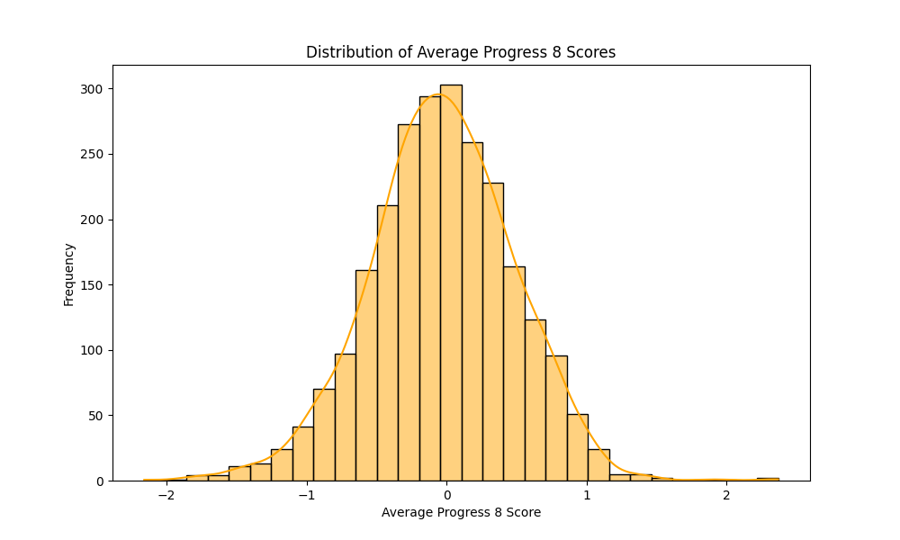
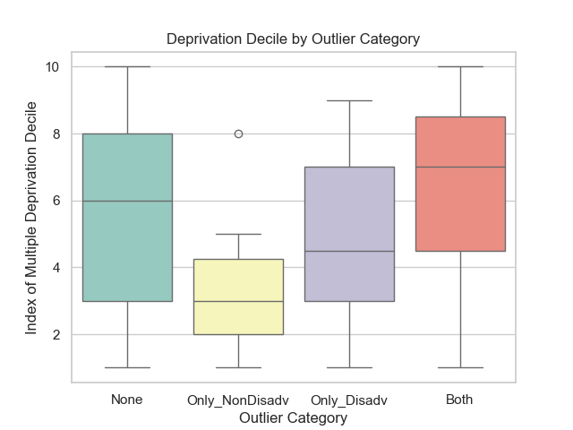
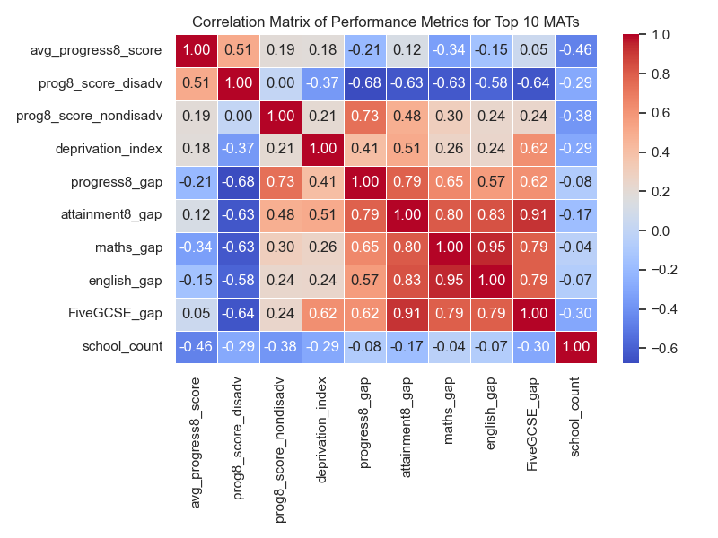

# Developing Education Equity: Analyzing Positive Outlier Schools' Performance at Key Stage 4 for Disadvantaged Pupils in the UK (2022/23)

## Project Overview

This project analyzes the performance of positive outlier schools in the UK during the 2022/23 academic year regarding their disadvantaged pupils' educational outcomes at Key Stage 4. The analysis focuses on the correlation between school performance—measured through the Progress 8 and Attainment 8 scores—and the Index of Multiple Deprivation (IMD).

### Dataset

The datasets for this project were sourced from the Department for Education (DfE) and the Ministry of Housing, Communities, and Local Government (MHCLG). They provide key metrics on school performance and socioeconomic data for the academic year 2022/23.

### Objectives

1. **Evaluate national disparities in educational performance between advantaged and disadvantaged pupils.**
2. **Identify and analyze outlier schools nationally for Progress 8 scores for disadvantaged pupils and investigate contributing factors.**
3. **Identify and evaluate the top-performing multi-academy trusts (MATs) in supporting disadvantaged pupils.**

## Project Plan

### 1. Sources of the Dataset

#### a) Department for Education (DfE)

Multiple datasets were sourced from the DfE's website [1][2]. The academic year 2022/23 is the most recent data, published on 1st February 2024. Five datasets from the DfE website are used in this analysis. Each dataset has a corresponding metadata file.

The datasets are merged based on the Unique Reference Number (URN) for each school. Progress 8 scores are used to evaluate school performance; this is a measure of the value-added by each school based on the progress made across eight qualifications of each pupil, using their Key Stage 2 results from Year 6 as a baseline.

The Attainment 8 score (total points across eight subjects) of each pupil is compared to the national average Attainment 8; the difference indicates the level of progress. A Progress 8 score of 1 indicates the student has performed one grade better than the national average.

Subjects included in Progress 8:

- **English and Mathematics** – both double-weighted due to importance.
- **EBacc Subjects** – three slots from subjects such as sciences, computer science, history, geography, and languages.
- **Open Group** – remaining three slots from other academic, arts, or vocational subjects.

The DfE provides data on the Progress 8 score and funding for disadvantaged and non-disadvantaged students, which is very convenient for analysis.

#### b) Index of Multiple Deprivation (IMD)

In addition to the datasets from the DfE, the deprivation index for each area in the UK is downloaded from the MHCLG website [3] and merged with the school information dataset using the school postcode. This allows for a more detailed analysis of the relationship between school performance and socioeconomic factors that may affect the performance of disadvantaged students.

### 2. Accuracy and Reliability of Data

The data is sourced from the DfE and the MHCLG websites, both official government sources, ensuring accuracy and reliability.

For the DfE data, both provisional and final Key Stage 4 (KS4) results are provided. The final results are quality assured for:

- **Completeness of data**: Results are verified.
- **Accuracy of data**: Results are corrected for any errors or omissions.
- **Usage**: Results are approved for use in official publications and are publicly available.

To categorize each school's socioeconomic status, the IMD decile is used, ranking each postcode in England between 1 and 10. The IMD is a composite measure based on several domains of deprivation, including income, employment, education, and health.

### 3. Data Quality, Usability, and Presentation

**Considerations:**

- **IMD Data Year**: The IMD data is from 2019 and is the nearest available year to the academic year 2022/23 of school performance data. Socioeconomic factors may have changed slightly since 2019, but the three-year gap is considered negligible for this analysis.
- **Dataset Merging**: The analysis is based on national school performance, including thousands of schools. 'Inner' joins are used to merge the datasets to ensure the analysis is not affected by unrecognized schools. Rows with missing values in key columns used for analysis are dropped.

## Project Aim and Objectives

### 1. Context and Motivation

**Context**

Having worked in education for two decades, more recently in high-performing and data-driven MATs, I've observed that the efficiency of a school or MAT in using its funds, alongside the impact of its pedagogical framework, can be reflected in Progress 8 scores. By five years of age, only 57% of disadvantaged pupils achieve a good level of development compared to 74% from better-off households [4]. The gap continues throughout education; in 2022/23, 29% of free-school meal (FSM) pupils went to university, while 49.8% of non-FSM pupils progressed to university [5].

**Motivation**

Several motivations underpin this analysis:

- **Policy Priority**: In a recent letter from the Secretary of State for Education, five priorities were set out for higher education providers, the top of which is:  
  *"Play a stronger role in expanding access and improving outcomes for disadvantaged students. The gap in outcomes from higher education between disadvantaged students and others is unacceptably large and is widening, with participation from disadvantaged students in decline for the first time in two decades."* [6]

- **Enhancing Education Practice**: Some secondary schools can close the gap, giving students from disadvantaged backgrounds better opportunities to progress to university. This data science investigation aims to identify outlier schools that outperform expectations.

- **Justifying School Funding**: With various funding avenues available—e.g., pupil premium for disadvantaged pupils, school-led tutoring funding—and results for FSM and non-FSM students, the efficiency of schools in using their funds can be evaluated. The correlation between Progress 8 scores of disadvantaged pupils and the level of funding schools receive to support them can be examined.

- **Understanding Demographic Factors**: Analyzing school demographics, such as gender, school type, and local authority, can help understand their influence on school performance.

- **Socioeconomic Factors**: The relationship between school performance and socioeconomic factors, such as deprivation, can be explored by merging school performance data with the deprivation index for each area in the UK. Other factors like the percentage of disadvantaged students, pupil premium funding, and the percentage of disadvantaged students achieving grades 9-5 in English and Maths can also be explored.

- **Impact of MAT**: The performance of group-level management, collaboration, and particularly outlier schools, can be explored to determine if there is a correlation between school performance and the type of MAT they belong to.

### 2. Specific Objectives

#### Objective 1: Evaluate National Disparities in Educational Performance Between Advantaged and Disadvantaged Pupils

Using comprehensive datasets from the DfE and the MHCLG, conduct a detailed national-level analysis of the performance gap in key metrics, including Progress 8, Attainment 8, and English and Mathematics scores. This involves merging, cleaning, and validating data before conducting statistical analysis to determine the level of the gap between disadvantaged and advantaged pupils.

#### Objective 2: Identify and Analyze Outlier Schools Nationally for Progress 8 Scores for Disadvantaged Pupils and Investigate Contributing Factors

Conduct in-depth statistical analysis to identify positive outlier schools with high Progress 8 scores for disadvantaged pupils. Further analysis on quantitative and categorical factors will determine the influence of socioeconomic indicators, such as the IMD and school demographics.

#### Objective 3: Identify and Evaluate the Top-Performing Multi-Academy Trusts in Supporting Disadvantaged Pupils

Conduct statistical analysis to identify top-performing MATs and their success in closing the disadvantage gap. Hypothesis testing and regression analysis will determine the impact level of potential factors.

## System Design

### 1. Architecture

**Key Components: Descriptions, Purpose, and Challenges**

#### 1. DfE Dataset 1: KS4 School Performance 2022/23

**Purpose**: Provides information on the academic performance of each school, including categories relating to advantaged and disadvantaged pupils in Progress 8, Attainment 8, and EBacc subjects.

**Key Fields Used for Analysis**:

- URN (Unique Reference Number)
- Average Attainment 8 Score
- Average Progress 8 Score
- Percentage of Disadvantaged Students
- Percentage of Non-Disadvantaged Students
- Percentage of Disadvantaged Students Achieving Grades 9-5 in English and Maths
- Percentage of Non-Disadvantaged Students Achieving Grades 9-5 in English and Maths
- Attainment 8 Score for Non-Disadvantaged Students
- Progress 8 Score for Non-Disadvantaged Students
- Attainment 8 Score for Disadvantaged Students
- Progress 8 Score for Disadvantaged Students
- Progress 8 Score in Maths for Disadvantaged Students
- Progress 8 Score in English for Disadvantaged Students
- Progress 8 Score in Maths for Non-Disadvantaged Students
- Progress 8 Score in English for Non-Disadvantaged Students

#### 2. Dataset 2: School Information

**Purpose**: Provides information on the demographics of each school.

**Key Fields Used in Analysis**:

- URN (Unique Reference Number)
- Local Authority Name (LANAME)
- Local Authority Code (LA)
- School Type
- Minor Group
- Gender
- Ofsted Rating

#### 3. Dataset 3: School Funding

**Purpose**: Provides information on various types of funding for each school.

**Key Fields Used in Analysis**:

- School UKPRN
- School URN
- Time Period
- FSM Funding
- FSM6 Funding
- Pupil Premium
- Pupil Premium Pupils
- School-Led Tutoring Funding
- Total Funding

#### 4. DfE Dataset 4: Multi-Academy Trust (MAT) Performance

**Purpose**: Provides performance information for each MAT.

**Key Fields Used from MAT Performance Data**:

- Trust Name
- Trust UID
- Trust ID
- Number of Institutions
- Total Pupils
- Average Attainment 8 Score
- Average Progress 8 Score
- Time Period

#### 5. Dataset 5: Academies Membership

**Purpose**: Provides information on which MAT each school belongs to, allowing external data like the IMD to be linked to schools via their postcode.

**Key Fields Used in Analysis**:

- URN
- Group UID
- Group ID
- Establishment Name
- Group Name
- Postcode

#### 6. MHCLG Data: Index of Multiple Deprivation (IMD)

**Purpose**: Allows for a detailed analysis of the relationship between school performance and socioeconomic factors affecting disadvantaged students.

**Key Columns Used for Analysis**:

- Postcode
- Index of Multiple Deprivation Decile

#### 7. Metadata

**Purpose**: To identify the appropriate columns for analysis from the DfE datasets.

#### 8. Classes

**Purpose**: To optimize processes, functions are organized into classes.

**Challenges**:

- **Column Selection**: Identifying appropriate columns from large DfE datasets.
- **Metadata Usage**: Using metadata files to match codes with descriptions.
- **Renaming for Clarity**: Rewriting codes to be clear to non-technical readers.
- **Data Types**: Ensuring data types are correct for quantitative analysis.
- **Feature Engineering**: Creating new fields like pupil premium funding per pupil.
- **Data Linking**: Connecting the IMD with each school, as MHCLG data lacks URN.

### 2. Pipeline and Workflow

**Steps**:

1. **Setup Functions and Classes**: Define necessary functions and classes for data loading, wrangling, and cleaning.
2. **Data Collection**:
   - Collect 2022/23 school and MAT performance data from the DfE.
   - Collect IMD data from the MHCLG.
3. **Metadata Analysis**: Read metadata files to understand data variables. Create dictionaries for codes and descriptions.
4. **Data Extraction**: Use metadata to extract key columns for analysis.
5. **Data Integration**: Merge datasets based on URN.
6. **Data Cleaning**: Remove missing values and inconsistencies. Convert data to appropriate types.
7. **Nomenclature**: Apply new naming conventions using metadata dictionaries.
8. **Feature Engineering**: Define new features like pupil premium funding per pupil.
9. **Socioeconomic Indexing**: Incorporate the IMD into the school information dataset.
10. **Statistical Analysis and Modeling**: Examine the advantage-disadvantage gap, identify outlier schools, and evaluate MAT performance.
11. **Visualization**: Create visualizations to present findings.
12. **Conclusion**: Summarize findings and relate them to the original objectives.

*For a more dynamic view, the workflow diagram can also be viewed here.*

### 3. Processing Modules and Algorithms

**Class: DataWrangler**

- **Methods**:
  - `load_csv`: Load a CSV file into a pandas DataFrame.
  - `load_excel`: Load an Excel file into a pandas DataFrame.
  - `make_dictionary`: Create a dictionary from a DataFrame.
  - `column_rename`: Rename columns in a DataFrame using a dictionary.
  - `convert_percentage_columns`: Convert percentage strings in specified columns to float values.
  - `get_school_details`: Retrieve specific columns from a given DataFrame using a set of URNs.
  - **Visualization Methods**: Plot boxplots, histograms, heatmaps, and scatter plots.
  - **Summary Statistics**: Generate summary statistics of the boxplots.

## Project Outcome

### Overview of Results

#### Objective 1: Evaluate National Disparities in Educational Performance

Significant gaps exist between non-disadvantaged and disadvantaged pupils in Attainment 8, Progress 8, Maths, English, and strong passes in both. Disadvantaged pupils lag behind by approximately 1.45 GCSE grades per subject and have an Attainment 8 gap of 11.6 points. Their Progress 8 scores are 0.6 grades lower across subjects than their peers, indicating significant performance gaps.

#### Objective 2: Identify and Analyze Outlier Schools in Positive Progress 8 of Disadvantaged Pupils

Schools excelling in Progress 8 for disadvantaged students tend to support all students well, showing a strong positive correlation (0.85) between overall and disadvantaged pupils. Interestingly, funding has a negative correlation with Progress 8 scores for disadvantaged pupils, warranting further investigation.

#### Objective 3: Identify and Evaluate Top-Performing Multi-Academy Trusts (MATs)

High-performing MATs show a strong positive correlation (0.51) between Progress 8 scores for disadvantaged students and overall scores. Although socioeconomic factors negatively correlate (-0.37) with progress, this hasn't been a barrier for high-performing MATs. For example, Star Academies is one of the highest-performing MATs, despite facing the highest deprivation average, suggesting robust pedagogical strategies and governance. Such MATs effectively close the gap (smallest is 0.264 in Progress 8) between disadvantaged and advantaged students, demonstrating efficient use of funding and better equity.

### Detailed Analysis

#### Objective 1: Evaluate National Disparities

**Explanation of Results:**

There are significant gaps in all measured categories between advantaged and disadvantaged pupils, confirming that nationally, disadvantaged pupils lag behind in every academic measure.

- **Attainment 8 Gap**:
  - *Disadvantaged*: 40.22
  - *Non-Disadvantaged*: 51.83
  - **Gap**: 11.61
  - **Analysis**: The gap suggests approximately 1.45 GCSE grades lower per subject for disadvantaged students (11.61 ÷ 8 ≈ 1.45).

- **Progress 8 Gap**:
  - *Disadvantaged*: -0.47
  - *Non-Disadvantaged*: 0.13
  - **Gap**: 0.60
  - **Analysis**: Disadvantaged pupils make 0.6 grades less progress across eight subjects between Key Stage 2 and Key Stage 4.

- **Subject-Specific Gaps**:
  - **Maths Gap**: 0.55
  - **English Gap**: 0.58
  - **Analysis**: Disadvantaged students underperform by approximately 0.55 grades in Maths and 0.58 grades in English.

- **Percentage 9-5 Gap in English and Maths**:
  - *Disadvantaged*: 28.09%
  - *Non-Disadvantaged*: 50.01%
  - **Gap**: 21.92%
  - **Analysis**: A significant gap indicates the need for targeted interventions.

**Visualizations**:

- **Progress 8 Score Distribution**:

  

- **Progress 8 and Attainment 8 Box Plots**:

  

- **English and Maths Progress 8 Scores Box Plots**:

  

#### Objective 2: Identify and Analyze Outlier Schools

**Explanation of Results**:

Outlier schools for Progress 8 were identified and categorized:

- **Both Disadvantaged and Non-Disadvantaged Outliers**: Schools performing significantly better for all pupils.
- **Only Disadvantaged Outliers**: Schools excelling specifically with disadvantaged pupils.
- **Only Non-Disadvantaged Outliers**: Schools performing well mainly with non-disadvantaged pupils.

**Key Findings**:

- A high correlation (0.85) exists between Progress 8 scores of disadvantaged pupils and overall Progress 8 scores.
- Funding shows a negative correlation with Progress 8 scores for disadvantaged pupils, which requires further exploration.
- A slight positive correlation with the percentage of disadvantaged pupils suggests that disadvantaged pupils may do better where there are more such pupils.
- The IMD shows a negative correlation, indicating that increased deprivation is associated with decreased Progress 8 scores for disadvantaged pupils.

**Visualizations**:

- **Heatmap of Outlier Schools**:

  

- **Summary Statistics for IMD Decile by Outlier Category**:

  | Outlier Category       | Median | Q1 (25%) | Q3 (75%) | IQR  | Min | Max  | Range |
  |------------------------|--------|----------|----------|------|-----|------|-------|
  | Both                   | 7.0    | 4.5      | 8.5      | 4.0  | 1.0 | 10.0 | 9.0   |
  | None                   | 6.0    | 3.0      | 8.0      | 5.0  | 1.0 | 10.0 | 9.0   |
  | Only Disadvantaged     | 4.5    | 3.0      | 7.0      | 4.0  | 1.0 | 9.0  | 8.0   |
  | Only Non-Disadvantaged | 3.0    | 2.0      | 4.3      | 2.3  | 1.0 | 8.0  | 7.0   |

  

- **Summary Statistics for Progress 8 by Outlier Category**:

  | Outlier Category       | Median | Q1 (25%) | Q3 (75%) | IQR   | Min    | Max   | Range |
  |------------------------|--------|----------|----------|-------|--------|-------|-------|
  | Both                   | 1.450  | 1.1950   | 2.140    | 0.945 | 0.81   | 2.37  | 1.56  |
  | None                   | -0.040 | -0.3600  | 0.290    | 0.650 | -2.16  | 1.83  | 3.99  |
  | Only Disadvantaged     | 0.955  | 0.8500   | 1.070    | 0.220 | 0.25   | 1.38  | 1.13  |
  | Only Non-Disadvantaged | 1.085  | 0.9375   | 1.125    | 0.188 | 0.61   | 1.49  | 0.88  |

  

- **Summary Statistics for Progress 8 Disadvantaged 2022 by Outlier Category**:

  | Outlier Category       | Median | Q1 (25%) | Q3 (75%) | IQR  | Min    | Max   | Range |
  |------------------------|--------|----------|----------|------|--------|-------|-------|
  | Both                   | 1.40   | 1.19     | 1.59     | 0.40 | 1.01   | 1.96  | 0.95  |
  | None                   | -0.50  | -0.87    | -0.14    | 0.73 | -2.43  | 0.99  | 3.42  |
  | Only Disadvantaged     | 1.09   | 1.07     | 1.13     | 0.06 | 1.01   | 1.21  | 0.20  |
  | Only Non-Disadvantaged | 0.60   | 0.51     | 0.78     | 0.27 | 0.22   | 0.99  | 0.77  |

  

#### Objective 3: Identify and Evaluate Top-Performing MATs

**Explanation of Results**

**Correlation Analysis**:

- **Progress 8 Score (Disadvantaged)** correlates positively with:
  - **Average Progress 8 Score**: 0.51
- Correlates negatively with:
  - **Deprivation Index**: -0.37
  - **Progress 8 Gap**: -0.68
  - **Maths Gap**: -0.63
  - **English Gap**: -0.58
  - **Attainment 8 Gap**: -0.63
  - **Five GCSE Gap**: -0.64
  - **School Count**: -0.29

**Key Findings**:

- High-performing MATs not only achieve high overall Progress 8 scores but also support disadvantaged students effectively.
- Socioeconomic factors negatively impact student progress, but top MATs mitigate these effects.
- A smaller Progress 8 gap between advantaged and disadvantaged pupils indicates better equity.

**Visualizations**:

- **Top 10 MATs Based on Progress 8 Disadvantaged Students**:

  

- **Correlation Matrix for Top 10 MATs**:

  

- **Progress of Disadvantaged vs. Advantaged Pupils**:

  

- **Deprivation Index vs. Progress 8**:

  

- **Deprivation Index vs. Progress 8 for Disadvantaged Pupils**:

  

## Conclusion and Presentation

### Achievements

- **Data Integration**: Successfully merged and cleaned datasets from the DfE and MHCLG, creating a reliable dataset for analysis.
- **Gap Analysis**: Confirmed significant educational gaps between disadvantaged and advantaged pupils across multiple performance metrics.
- **Outlier Identification**: Identified and analyzed positive outlier schools and top-performing MATs that effectively support disadvantaged pupils.
- **Strategic Insights**: Demonstrated that certain schools and trusts can close the disadvantage gap and achieve high performance despite socioeconomic challenges.

### Limitations

- **Regression Analysis**: Further statistical modeling could provide deeper insights into causation.
- **Temporal Factors**: The impact of the time schools have been part of a MAT was not fully explored.
- **Qualitative Factors**: Cultural influences and qualitative data were beyond the scope of this analysis.

### Future Work

- **Outlier Trusts—Strategy and Framework**: Further explore the strategies of outlier trusts that have managed to close the disadvantage gap.
- **Funding Allocation and Usage**: Investigate the effective use of funding in schools and MATs. This may require additional data from Ofsted reports or internal policies.
- **Time Series Analysis**: Work with a larger dataset spanning multiple years to analyze trends over time.
- **Machine Learning Models**: Apply machine learning techniques, such as clustering and unsupervised learning, to uncover hidden patterns.
- **Geospatial Analysis**: Conduct geospatial analysis to evaluate schools based on proximity and geographic distribution.
- **Text Analysis**: Perform text analysis of Ofsted reports to correlate qualitative assessments with performance metrics.

## References

[1] Department for Education. (n.d.). Explore education statistics: Data tables. Retrieved November 1, 2024, from https://explore-education-statistics.service.gov.uk/data-tables

[2] Department for Education. (n.d.). Compare the performance of schools and colleges in England. Retrieved November 10, 2024, from https://www.gov.uk/school-performance-tables

[3] Ministry of Housing, Communities & Local Government. (2019). English Indices of Deprivation 2019: Postcode Lookup. Retrieved from https://imd-by-postcode.opendatacommunities.org/imd/2019

[4] Institute for Fiscal Studies. (2024, May). The past and future of UK health spending. Retrieved from https://www.ifs.org.uk/publications/health-spending-report

[5] Busby, E. (2024, October 24). Gap between private and state school pupils going to top universities widens. *The Independent*. Retrieved from https://www.independent.co.uk/news/uk/gap-england-department-for-education-government-data-b2634966.html

[6] Phillipson, B. (2024, November 4). Letter from the Secretary of State for Education. Department for Education.

[7] Tes. (2024, January 17). How many schools are there in the UK? Retrieved from https://www.tes.com/magazine/analysis/general/how-many-schools-in-the-uk

---
